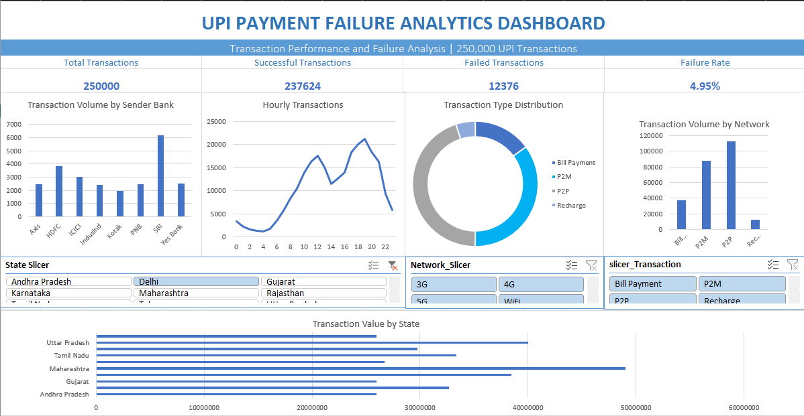

# UPI Payment Failure Analytics & Anomaly Detection

An end-to-end data analytics project that analyzes 250,000 UPI transactions to understand transaction behavior, investigate payment failures, detect anomalies, validate relationships statistically, and evaluate transaction failure prediction.

## Dashboard Preview



## Overview

Digital payment systems generate large volumes of transactional data, making it important to monitor transaction performance and understand payment failures.

This project follows a complete analytics workflow, starting with raw transaction data and progressing through data quality assessment, exploratory analysis, statistical testing, anomaly detection, machine learning, SQL analysis, and an interactive Excel dashboard.

The analysis focuses on transaction patterns across banks, transaction types, networks, states, and different hours of the day.

## Dataset

The dataset contains **250,000 UPI transactions** with **17 attributes**, including transaction amount, status, type, sender and receiver banks, network type, device type, location, transaction time, and fraud indicators.

The data quality assessment identified no missing values, duplicate rows, or duplicate transaction IDs.

## Analytical Workflow

```text
Raw Data
   ↓
Data Quality Assessment
   ↓
Exploratory Data Analysis
   ↓
Statistical Hypothesis Testing
   ↓
Anomaly Detection
   ↓
Failure Prediction
   ↓
SQL Analysis
   ↓
Interactive Excel Dashboard
Statistical Analysis

Chi-Square tests were performed to investigate potential relationships between transaction characteristics and payment outcomes.

The analysis found insufficient statistical evidence to establish a significant association between network type and transaction status. Similarly, transaction type did not demonstrate a statistically significant association with transaction outcomes.

This stage demonstrates the importance of validating assumptions statistically rather than relying only on visual patterns.

Anomaly Detection

Z-score analysis was used to identify unusual transaction patterns and potential deviations from normal transaction behavior.

The analysis demonstrates how statistical methods can support the identification of unusual activity that may require further investigation.

Transaction Failure Prediction

A Logistic Regression model was developed to predict the probability of transaction failure.

The dataset contained 237,624 successful transactions and 12,376 failed transactions, resulting in an overall failure rate of 4.95%.

The model achieved a ROC-AUC score close to 0.50, indicating limited predictive capability with the available features. This highlights the challenges of class imbalance and demonstrates that high accuracy alone is not sufficient when evaluating machine learning models.

The analysis suggests that additional operational features, such as gateway load, server response time, and system availability, would be required to build a more effective failure prediction model.

SQL Analysis

MySQL was used to perform business-focused analysis on the transaction dataset.

The analysis includes transaction filtering, aggregations, bank-wise and state-wise analysis, transaction failure analysis, and grouped analysis using SQL concepts such as WHERE, GROUP BY, HAVING, COUNT, SUM, AVG, MAX, and MIN.

Interactive Excel Dashboard

The final stage of the project involved developing an interactive Microsoft Excel dashboard.

The dashboard presents key transaction metrics and visualizes transaction volume by sender bank, hourly activity, transaction type, network type, and sender state.

The dashboard also includes interactive slicers that allow users to filter the analysis dynamically.

Key Results
Metric	Result
Total Transactions	250,000
Successful Transactions	237,624
Failed Transactions	12,376
Failure Rate	4.95%
Network vs Status Test	Not Statistically Significant
Transaction Type vs Status Test	Not Statistically Significant
Logistic Regression ROC-AUC	0.50
Technology Stack

Python: Pandas, NumPy, Matplotlib, Seaborn, SciPy, Scikit-learn

Database: MySQL

Visualization: Microsoft Excel, PivotTables, PivotCharts, Slicers

Version Control: Git and GitHub

Project Structure
UPI-Payment-Failure-Analytics/
│
├── data/
│   ├── raw/
│   │   └── upi_transactions.csv
│   └── processed/
│       └── upi_transactions_clean.csv
│
├── python/
│   ├── 01_data_quality_check.py
│   ├── 02_eda.py
│   ├── 03_statistical_analysis.py
│   ├── 04_anomaly_detection.py
│   └── 05_failure_prediction.py
│
├── sql/
│   └── upi_analysis.sql
│
├── dashboard/
│   └── UPI_Payment_Failure_Analytics.xlsx
│
├── images/
│   └── dashboard.png
│
├── report
├── requirements.txt
└── README.md

Conclusion

This project demonstrates an end-to-end data analytics workflow by combining data analysis, statistical reasoning, anomaly detection, machine learning, SQL, and interactive data visualization.

A key outcome of the project is recognizing the limitations of the available data. While the analysis successfully identified transaction patterns and produced an interactive dashboard, the failure prediction model showed that additional operational features would be necessary for reliable prediction.

Moin Farooqui
Data Analytics | Python | SQL | Excel
